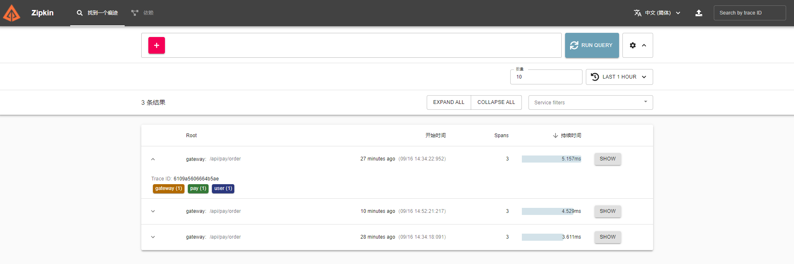
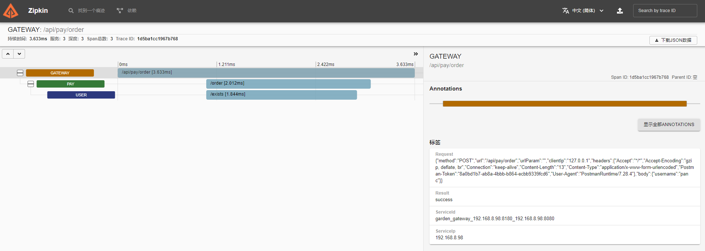

## 基于Go Garden快速构建微服务

> Go Garden的Http服务基于Gin开发，在教程中会涉及到Gin框架的一些内容，例如请求上下文、中间件等，如开发者不了解Gin，请先去看看Gin相关文档！

### 1. 准备工作

Go Garden基于Etcd实现服务注册发现，基于Zipkin实现服务链路追踪，所以需要成功启动必须安装好Etcd和Zipkin

* 在这里给不熟悉的同学介绍Docker快速安装
* 准备好一个Linux系统虚拟机，且安装好Docker
* Docker启动的默认参数可能在高并发压力测试时会崩，建议自行调整参数或者搭建服务环境

启动Etcd：

```
docker run -it -d --name etcd -p 2379:2379 -e "ALLOW_NONE_AUTHENTICATION=yes" -e "ETCD_ADVERTISE_CLIENT_URLS=http://0.0.0.0:2379" bitnami/etcd
```

启动Zipkin：

```
docker run -it -d --name zipkin -p 9411:9411 openzipkin/zipkin
```

### 2. Gateway网关服务

创建gateway目录后进入目录

执行 `go mod init gateway` 初始化项目

新建go程序入口文件 `main.go` 并输入以下代码：

```golang
package main

import (
	"github.com/gin-gonic/gin"
	"github.com/panco95/go-garden/core"
)

var service *core.Garden

func main() {
	service = core.New()
	service.Run(service.GatewayRoute, Auth)
}

// Auth Customize the global middleware
func Auth() gin.HandlerFunc {
	return func(c *gin.Context) {
		// before logic
		c.Next()
		// after logic
	}
}
```

安装go mod包： `go mod tidy`

执行程序：`go run main.go`

这时候程序会报一个错误且异常退出，因为没办法继续执行下去：

```
PS D:\go-garden\examples\gateway> go run .\main.go
2021/09/18 13:58:22 [Config] Config File "config" Not Found in "[D:\\go-garden\\examples\\gateway\\configs]"
exit status 1
```

观察日志内容可知道，找不到配置项config，因为还没有创建配置文件，接下来讲解下配置文件。

在项目根目录创建 `configs` 目录并且在目录下创建配置文件 `config.yml` ，把相关配置输入，记得修改相关配置为你的环境噢，192.168.125.184 是我开发环境Linux虚拟机的ip啦~ ：

```yml
service:
  Debug: true
  ServiceName: gateway
  HttpPort: 8080
  RpcPort: 8180
  CallServiceKey: garden
  EtcdAddress:
    - 192.168.125.185:2379
  ZipkinAddress: http://192.168.125.185:9411/api/v2/spans

config:
```

`service`表示Go Garden启动服务必填配置项，`config`表示服务自定义配置项

`gateway`不需要配置`config`

下面详细说明了service每个配置项的作用：

|        配置项         |                                         说明                                         |
| -------------------- | ------------------------------------------------------------------------------------ |
| Debug                | 调试模式开关（true：日志打印和文件存储；false：日志仅文件存储不打印）                       |
| ServiceName          | 服务名称                                                                              |
| HttpPort             | http监听端口                                                                          |
| RpcPort              | rpc监听端口                                                                           |
| CallServiceKey       | 服务之间调用的密钥，记住请保持每个服务这个配置相同                                         |
| EtcdAddress          | Etcd地址，填写正确的IP加端口，如果是etcd集群的话可以多行填写对应地址                       |
| ZipkinAddress        | zipkin服务的api地址                                         

好了，配置文件创建好了，那么现在再来启动一下程序 `go run main.go` 看看吧！

本以为会开开心心的看到程序启动成功，没想到又报了一个错：

```
PS D:\go-garden\examples\gateway> go run .\main.go
2021/09/18 14:03:41 [Config] Config File "routes" Not Found in "[D:\\go-garden\\examples\\gateway\\configs]"
exit status 1
```

这也是一个配置文件找不到的错误，但是呢，不是上面创建的 `config.yml` ，这次是缺少了 `routes.yml` ，这个配置文件是干嘛的呢？

想想看，不管是gateway网关调用下游业务服务还是服务A调用服务B，是不知道下游服务的具体请求地址的，可能只知道他这个接口叫做 `login`，可能完整的地址是 `/api/user/login`
，也可能是 `/api/v1/user/login`，那么现在要调用服务B的 `login`
，就要根据路由配置来获取具体的请求地址。在传统架构里可能直接把地址写在代码里面，万一某一天服务B修改了这个接口的路由，那么得在所有上游服务修改代码更新为正确地址。

好了，言归正传，现在来创建路由配置 `routes.yml` 吧！

```yml
routes:
  user:
    login:
      path: /login
      limiter: 5/1000
    exists:
      path: /exists
      limit: 5/1000
  pay:
    order:
      pather: /order
      limiter: 5/1000
```

首先第一行是固定的，不用修改，看第二行 `user` ，表示的是user服务，因为Go Garden是微服务框架嘛，那么一个项目肯定会拆分到很多的服务，例如 用户中心、支付中心、数据中心等等，这里的 `user` 代表的就是用户中心服务；

`user`下面有两项，分别是 `login` 和 `exists` ，它们表示的是user服务有两个接口，名称分别为 login 和 exists；

每个接口下面包含`path`和`limiter`参数：

1、`path`表示请求接口路由：如果服务 `login` 接口路径是 `/api/v1/login` ，那么就要在这里要在这里修改它，`user`
服务监听login接口应该是这样子的： `    r.POST("login", func(c *gin.Context) {...})` ，那么依次类推下面的 `exists` 接口和下面的 `pay` 服务的 `order`
接口都是一样的意思，在这里为了简单就没有写多余的接口路径，大家在实际开发项目中是可以增加 `v1` 这样的前缀的，以免未来更新接口不兼容老接口时可以增加 `v2` 前缀，总之，这个配置文件就是为了实现 `服务->接口名->接口路由`
这个规则。

2、`limiter`表示服务接口限流策略：5/1000表示接口每5秒钟之内最多处理1000个请求，如果超出1000个请求，直接会返回错误响应。

现在把配置文件创建好后，可以再次启动程序 `go run main.go` ：

```
PS D:\go-garden\examples\gateway> go run .\main.go
2021-09-18T14:06:12.665+0800    INFO    core/gin.go:46  [gateway] Http listen on port: 8080
2021-09-18T14:06:12.665+0800    INFO    core/rpc.go:20  [gateway] Rpc listen on port: 8180
```

gateway网关服务启动成功啦！根据打印信息，可以看到服务监听了 http和rpc两个端口。 现在可以用postman访问网关服务了，地址： `http://127.0.0.1:8080`
，会返回404状态码，因为没有带上路由所以网关找不到怎么请求下游服务的路由配置，带上配置好的路由试试：`http://127.0.0.1:8080/api/user/login`，可以发现网关通过路由配置访问下游服务的格式为 `
/api/服务名称/接口名称`，api前缀是固定的，访问这个地址不会返回404了，而是返回500状态码且带上了一个json格式数据：

```json
{
  "status": false
}
```

status是一个bool格式，false说明请求出错了，查看日志信息：

```log
2021-09-18T14:08:49.544+0800    DEBUG   core/gateway.go:33      [CallService] service index not found
```

看出是调用下游服务 `user`的`login`接口出错， `service index not found` 是因为并没有启动`user`服务，所以Go Garden并找不到服务地址，所以根本没法请求到下游的`user`
服务，那么我们下面继续启动`user`服务。

### 3. User服务

跟gateway服务步骤一样创建好项目`user`和配置文件`config.yml`、`routes.yml`：

修改服务名称和监听端口，增加三个redis相关配置项：

```
service:
  Debug: true
  ServiceName: user
  HttpPort: 8081
  RpcPort: 8181
  CallServiceKey: garden
  EtcdAddress:
    - 192.168.125.185:2379
  ZipkinAddress: http://192.168.125.185:9411/api/v2/spans

config:
  redisAddr: 192.168.125.185:6379
  redisPass:
  redisDb: 0
```

创建main.go程序启动入口文件：

```golang
package main

import (
	...
)

var service *core.Garden

func main() {
	service = core.New()

	if err := redis.Connect(
		service.GetConfigValueString("redisAddr"),
		service.GetConfigValueString("redisPass"),
		service.GetConfigValueInt("redisDb"),
	); err != nil {
		service.Log(core.FatalLevel, "redis", err)
	}

	service.Run(Route, nil)
}

func Route(r *gin.Engine) {
	r.Use(service.CheckCallSafeMiddleware()) // 调用接口安全验证
	r.POST("login", Login)
	r.POST("exists", Exists)
}

func Login(c *gin.Context) {
	...
}

func Exists(c *gin.Context) {
	...
}
```

我们使用了`go garden`封装的`redis`客户端连接代码；
这里省略了接口业务代码，请查看示例代码[examples/user](https://github.com/panco95/go-garden/tree/master/examples/user)

观察代码，启动服务的时候有两个参数跟gateway不一样：

1、`service.Run()`第一个参数是路由，因为gateway的路由是在Go Garden内部集成的，所以`gateway`服务直接使用了`service.GatewayRoute`，`user`
服务需要自己实现路由，就是下面的`Route`函数，这是基于`Gin`框架的路由，第一行`r.Use(service.CheckCallSafeMiddleware())`这是校验服务调用密钥的中间件，防止客户端跳过`gateway`
直接请求`user`，这样的话`gateway`就发挥不了作用了，下面两行`r.Post("login",Login)`和`r.Post("exists",Exists)`就是具体的接口实现，再看看`routes.yml`
可以看出是对应上的，假设这么写路由`r.Post("v1/login",Login)`，那在`routes.yml`应该写成`login: /v1/login`;

2、第二个参数是全局中间件，在`gateway`网关服务中需要实现全局鉴权，所以我们添加了一个`Auth`中间件，我们假设`user`不需要单独的鉴权，所里这里直接写`nil`。


> 注意：示例代码逻辑实现用到了redis，所以我们需要启动redis服务以及在`config.yml`中填写连接地址。

Docker启动redis：

`docker run -it -d --name redis -p 6379:6379 redis`

一切准备就绪，启动`user`服务：`go run main.go`，查看输出：

```
PS D:\go-garden\examples\user> go run .\main.go
2021-09-18T14:10:00.049+0800    INFO    core/gin.go:46  [user] Http listen on port: 8081
2021-09-18T14:10:00.050+0800    INFO    core/rpc.go:20  [user] Rpc listen on port: 8181
```

跟`gateway`一样，监听了Http、Rpc两个端口，同时启动服务的时候还做了一件事情，就是`发现`了上面启动的的`gateway`服务；

接着我们切换到`gateway`服务的窗口，也输出了两行打印信息：

```
2021-09-18T14:10:00.046+0800    INFO    core/service_manager.go:99      [Service] [user] node [192.168.8.98:8181_192.168.8.98:8081] join
```

> 表示`gateway`发现了`user`的一个服务节点；

总结一下，这就是Go Garden的`服务自动注册发现`特性，不论你启动多少个服务多少个节点，它们都能互相发现和通信。

现在`user`服务启动成功，现在可以再次使用postman访问`gateway`的`user`
服务路由：`http://127.0.0.1:8080/api/user/login`，增加一个请求参数`username`，发送请求，响应如下：

```json
{
  "code": 0,
  "data": null,
  "msg": "登录成功",
  "status": true
}
```

返回参数`status`为`true`表示请求成功，注意，只有`status`参数是`gateway`返回的，以告诉客户端请求是否成功，其他参数都是`user`返回的，这样使得`gateway`
和其他服务耦合度降低，数据格式可以由开发者自行设计。

### 4. 服务集群

Go Garden基于`服务自动注册发现`特性，支持大规模的服务集群，例如`user`服务我们可以启动多个示例，现在我们复制一份`user`服务的代码，修改`config.yml`的两个监听端口防止端口冲突，改好端口后启动第二个`user`
服务节点：`go run main.go`，查看输出：

```
PS D:\go-garden\examples\user2> go run .\main.go
2021-09-18T14:28:16.811+0800    INFO    core/gin.go:46  [user] Http listen on port: 8280
2021-09-18T14:28:16.812+0800    INFO    core/rpc.go:20  [user] Rpc listen on port: 8281
```

这是启动的第二个`user`服务节点，`gateway`节点和第一个`user`节点都会`发现`它，切换到`gateway`和`user`节点1窗口，都会输出：

```
2021-09-18T14:28:16.807+0800    INFO    core/service_manager.go:99      [Service] [user] node [192.168.8.98:8281_192.168.8.98:8280] join
```

现在`user`服务右两个节点，我么可以称之为`user`服务集群，那么`gateway`调用`user`服务的时候会是什么一个情况呢？

我们再次使用Postman给`gateway`发送多次请求：`http://127.0.0.1:8080/api/user/login` ，会发现`user`服务节点1和节点2都会打印请求日志，这是`gateway`
服务控制的下游服务集群的负载均衡，Go Garden默认使用最小连接数算法进行选取下游服务节点，在负载非常低时使用随机算法选取下游服务节点；

如果`gateway`也是集群怎么给`gateway`负载均衡呢，建议是增加一层较稳定的`webserver`例如`nginx`，在`nginx`层增加对`gateway`网关的负载均衡。

### 5. 服务之间调用

现在解决了`gateay`网关到下游服务的路由分发，那么现在来解决服务到服务之间的调用，上面`user`服务的`exists`接口就是提供给其他服务调用（查询某用户是否存在）；

现在来创建一个`pay`服务，`config.yml`中`ServiceName`改为`pay`，RpcPort和HttpPort修改为没有使用过的端口，然后创建main.go程序启动入口文件：

```golang
package main

import (
	...
)

var service *core.Garden

func main() {
	service = core.New()
	service.Run(Route, nil)
}

func Route(r *gin.Engine) {
	r.Use(service.CheckCallSafeMiddleware())
	r.POST("order", Order)
}

func Order(c *gin.Context) {
	...
}
```

这里省略了接口业务代码，请查看示例代码[examples/pay](https://github.com/panco95/go-garden/tree/master/examples/pay)

观察代码，`pay`服务有一个`order`接口，这是下单接口，请求这个接口需要传参数`username`，用Postman请求一下试试吧！增加`username`请求参数，请求`gateway`
地址：`http://127.0.0.1:8080/api/pay/order` ，随便填看看返回什么：

```json
{
  "code": 1000,
  "data": null,
  "msg": "下单失败",
  "status": true
}
```

下单失败了，原因是`order`接口中间会调用`user`服务`exists`接口查询你传入的`username`是否在系统中存在，如果存在才会下单成功，我们观察调用`user`服务核心代码：

```golang
    span, err := core.GetSpan(c)

...

username := c.DefaultPostForm("username", "")

result, err := service.CallService(span, "user", "exists", &core.Request{
Method: "POST",
Body: core.MapData{
"username": username,
},
})

...

var res core.MapData
err = json.Unmarshal([]byte(result), &res)

...

data := res["data"].(map[string]interface{})
exists := data["exists"].(bool)
if !exists {
c.JSON(http.StatusOK, ApiResponse(1000, "下单失败", nil))
return
}
orderId := utils.NewUuid()
c.JSON(http.StatusOK, ApiResponse(0, "下单成功", core.MapData{
"orderId": orderId,
}))
```

* 首先函数开头从请求上下文获取`span`，这是链路追踪相关变量，暂时不管
* 接着获取请求参数`username`
* 下面是调用服务核心函数`service.CallService`，第二个参数表示服务名称，第三个参数表示接口名称，这里我们调用的是`user`服务的`exists`接口，第四个参数表示请求报文，我们定义了参数`username`
* 请求成功后，我们接收到`user`返回的数据，如果返回参数`exists`为true就生成订单号返回成功数据

现在重新请求`http://127.0.0.1:8080/api/user/login`和`http://127.0.0.1/api/pay/order` ，记得两次请求参数`username`
要保持一致，这样业务逻辑才会顺畅，下单接口正确返回数据如下：

```json
{
  "code": 0,
  "data": {
    "orderId": "7d7111af-0090-419b-84cb-fa4db023fba0"
  },
  "msg": "下单成功",
  "status": true
}
```

大功告成，服务之间的相互调用就是这么简单！

### 6. 分布式链路追踪

刚刚执行的若干请求，实际上不仅在服务目录生成了日志文件，还在链路追踪服务里记录了一个请求的完整trace日志，也就是客户端请求由`gateway->pay->user`的完整服务执行路径；

准备工作中我们用Docker启动了`Zipkin`，现在要去后台查看数据了，使用浏览器打开`Zipkin`启动服务器IP的9411端口，例如我的虚拟机地址为`http://192.168.125.184:9411`;

打开后就是`Zipkin`的后台界面，我们点击`Run Query`按钮查询，查询结果就出来了，一个`order`接口请求经过三个服务，每个服务的执行时间和相关调试数据都可以查询到，截图：




我们在业务代码里也可以非常简单的存储调试数据，Go Garden内部已经实现了服务之间的链路关联，代码示例：

```golang
func Test(c *gin.Context) {
span, _ := service.GetSpan(c) //获取span
span.SetTag("key", "value")   //存储数据
}
```

在写业务接口的适合，不仅可以使用`garden.Logger`输出日志，还可以使用`span`输出链路追踪日志，大家可以根绝业务情况同时使用。

### 7. 动态配置与同步

1、不管是`gateway`路由分发还是其他服务之间调用，Go Garden都是读取`routes.yml`配置文件来做相关操作的，假设需要修改/增加/删除一个路由配置，Go Garden会监听到`routes.yml`
配置文件的变化从而更新路由配置，这是单机服务动态配置；

2、Go Garden是分布式的微服务框架，并不是一个单机的服务，有各种服务集群在线上运行。那么问题来了，如何保证所有服务集群配置统一呢？

Go Garden实现了所有服务之间的`routes.yml`配置文件实时同步，并不需要开发者关心同步逻辑；开发者只需要更新整个架构中任意一个服务的配置文件，就会自动同步到其他服务；

试着修改`gateway`服务的`routes.yml`后保存，然后打开其他服务的配置文件看看，会发现已经同步好了。

3、动态配置与同步仅支持`routes.yml`，`config.yml`配置项是服务必备配置项所以不建议动态修改；

4、业务中可使用service.GetConfigString()等方法获取服务自定义配置项。

### 8. 日志

提示：配置文件的`Debug`参数为`true`时，代表调试模式开启，任何日志输出都会同时打印在屏幕上和日志文件中，如果改为`false`，不会在屏幕打印，只会存储在日志文件中

Go Garden封装了规范的日志函数，用如下代码进行调用：

```golang
    service.Log(core.ErrorLevel, "JsonUnmarshall", err)
```

第一个参数为日志级别，在源码`core/standard.go`文件中有定义，第二个参部为日志标识，第三个参数为日志内容，建议传入`error`或`string`变量。

### 9. 服务监控

* 每个服务都默认开启pprof，访问路径 `/debug/pprof`
* 网关服务可以通过接口查询当前所有服务节点的状态，访问路径为`/healthy`，waiting为节点当前连接数，finish为处理完成计数，可使用ab压力测试工具测试观察负载均衡是否均衡：

```json
{
  "services": {
    "gateway": {
      "Nodes": [
        {
          "Addr": "192.168.8.98:8180_192.168.8.98:8080",
          "Waiting": 0,
          "Finish": 0
        }
      ]
    },
    "pay": {
      "Nodes": [
        {
          "Addr": "192.168.8.98:8182_192.168.8.98:8082",
          "Waiting": 0,
          "Finish": 0
        }
      ]
    },
    "user": {
      "Nodes": [
        {
          "Addr": "192.168.8.98:8181_192.168.8.98:8081",
          "Waiting": 14,
          "Finish": 3114
        },
        {
          "Addr": "192.168.8.98:8281_192.168.8.98:8280",
          "Waiting": 19,
          "Finish": 2915
        }
      ]
    }
  }
}
```

### 10. 接口级粒度的服务限流

在`config.yml`中我们可以给每个服务的每个接口配置单独的限流规则`limiter`参数，`5/1000`表示每5秒钟之内最多处理1000个请求，超出数量不会请求下游服务。

### 11. 服务重试策略

在调用下游服务时，下游服务可能会返回错误，Go Garden会采取自动重试机制，默认重试请求3次，第第次重试间隔0.1秒，第二次重试间隔0.2秒，第三次重试间隔0.3秒，如果第三次还是错误响应，会放弃请求下游服务，返回错误响应。
