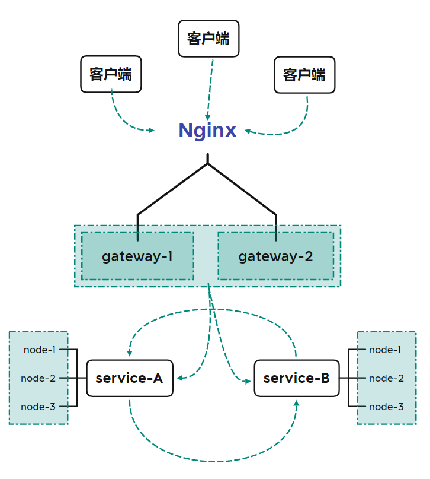

# Go Garden 
[](https://opensource.org/licenses/Apache-2.0) [](https://pkg.go.dev/github.com/panco95/go-garden) [](https://goreportcard.com/report/github.com/panco95/go-garden) 


go-garden是一款面向分布式系统架构的微服务框架

## 概念

* go-garden为分布式系统架构的开发提供了核心需求，包括微服务的一些基础架构支持，减少开发者对微服务的基础开发，更着力于业务开发；
* go-garden底层Http服务使用Gin，并非使用原生Http包或自己设计的包，考虑到稳定性和开发易用性，如果您没有使用过Gin，可以先去阅读一下Gin框架文档；
* go-garden并没有集成数据库、缓存之类的扩展，这里考虑到使用者对服务的设计可能会使用到不同的包，建议开发者自己导入这类扩展包使用，且go-garden并不限制代码结构，只需要配置文件和几行代码就可以启动一个服务，项目的结构完全由开发者自行设计，这个理念与`Gin`保持一致。

## 架构




## 特性

- **注册发现**

- **网关路由**

- **负载均衡**

- **服务限流**

- **服务熔断**

- **服务重试**

- **超时控制**

- **动态路由**

- **自动同步**

- **安全认证**

- **链路追踪**

## 快速开始

```golang
import "github.com/panco95/go-garden/core"

var service *core.Garden

func main() {
    service = core.New()
    service.Run(nil, nil)
}
```

## 教程：基于Go Garden快速构建微服务
访问 [基于Go Garden快速构建微服务](docs/tutorial.md) 跟着一步一步学习如何使用go-garden

## 教程：代码示例
访问 [examples](examples) 查看示例教程代码

## 脚手架：快速创建项目工具
访问 [gctl](tools/gctl) 查看工具使用

## 特别鸣谢
感谢 **JetBrains** 为本项目免费提供的正版 **IDE** 激活码，支持正版请前往购买：[Jetbrains商店](https://www.jetbrains.com/store/#commercial?billing=yearly)

## 许可证

Go Garden 包含 Apache 2.0 许可证